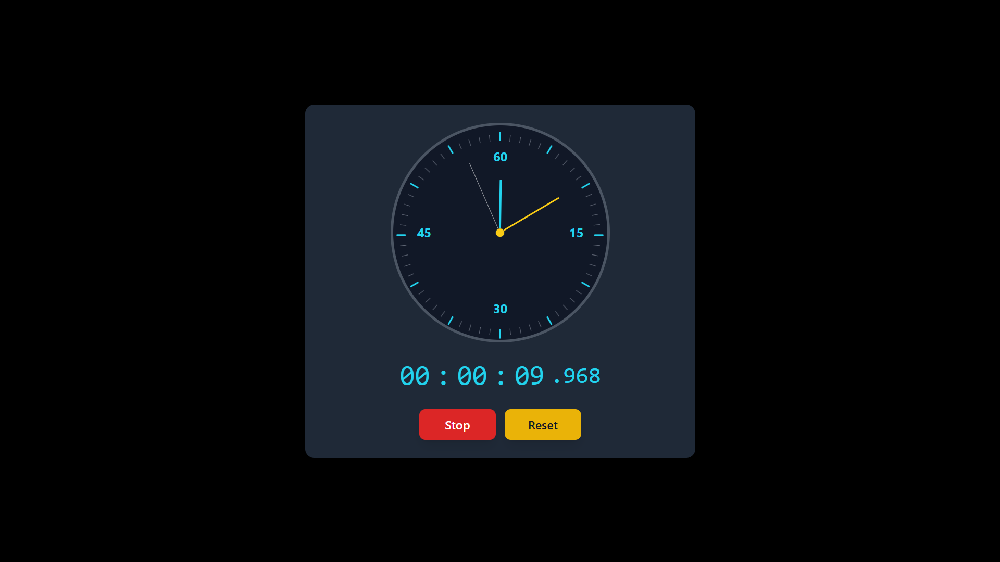

# ⏱️ React Stopwatch

Welcome to the **React Stopwatch**—a simple, elegant, and responsive stopwatch application built with React and styled with Bootstrap for a clean, modern look.

[](https://react-stopwatch-henna-rho.vercel.app//)



## 🌟 Features

- **Start, Stop, and Reset** functionality
- **Intuitive Design** with a clean and minimal interface
- **Responsive**: Works smoothly on both desktop and mobile devices

## 🎨 Technologies Used

- **React**: For building the stopwatch functionality
- **Bootstrap**: For styling and responsive design
- **JavaScript**: To handle stopwatch logic

## 🚀 Getting Started

### Prerequisites

Ensure you have the following installed:

- **Node.js**
- **npm** or **yarn**

### Installation

1. **Clone the repository**:

```bash
  git clone https://github.com/deepakpatil26/react_stopwatch.git
```

2. **Navigate to the project directory**:

```bash
cd react_stopwatch
```

3. **Install dependencies**:

```bash
npm install
```

or

```bash
yarn install
```

4. **Start the application**:

```bash
npm start
```

or

```bash
yarn start
```

- The stopwatch app will be available at <http://localhost:3000>.

🤝 Contributing
Contributions are welcome! If you'd like to add new features or improve the existing code, feel free to fork the repository and submit a pull request.

**Contribution Steps**:

1. Fork the project

2. Create a feature branch

```bash
git checkout -b feature/NewFeature
```

3. Commit your changes

```bash
git commit -m 'Add new feature'
```

4. Push to the branch

```bash
git push origin feature/NewFeature
```

5. Open a pull request

📜 License:

- This project is licensed under the MIT License.
  Feel free to use, modify, and distribute it as per the terms of the license.
